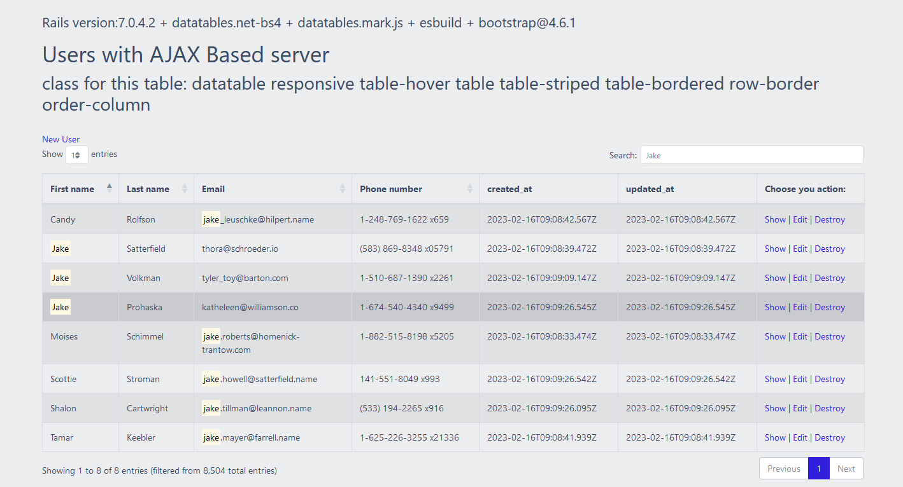

# README

This is a working example of Rails 7 with datatables, bootstrap4 and esbuild.

At the root of this rails app run:

`yarn install` to install the node dependencies

`bundle install` to install the rails dependencies

`rails db:migrate` to migrate the simple database

`rails db:seed` to use faker to load sample data

`foreman start -f Procfile.dev` to run the server at http://0.0.0.0:3003

 http://127.0.0.1:3003 (not ajax server based)
 
 http://127.0.0.3:3003/users (ajax server based)
 
 

Needed to add the following to config/initializers/assets.rb

`Rails.application.config.assets.paths << Rails.root.join("node_modules/datatables.net-bs4/css")`

# References:
https://datatables.net/forums/discussion/71158/rails-7-with-esbuild-how-to-install-datatables

https://datatables.net/examples/styling/bootstrap4.html

https://github.com/driftingruby/082-datatables
